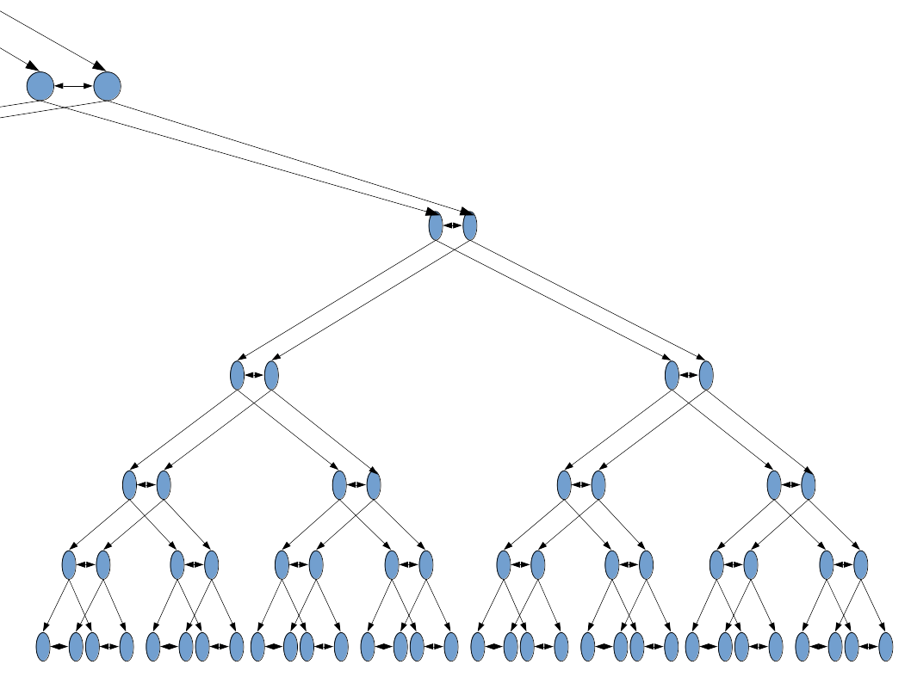

Modern consumer grade streaming solutions require very large concentrations of servers and bandwidth. These concentrations and their operators are vulnerable to censorship, state or business coercion, and simple bureaucratic stupidities. 
PeerStream avoids this problem by having nodes forward the payload data to each other in a structured fashion. In this paradigm each additional user adds capacity instead of consuming it. This allows stream creators to run their own infrastructure with minimal resources.

Existing peer to peer streaming tools require users to download and run untrusted software, find a stream that happens to use the software, enter the stream into the software separately. This makes the software implausible for non technical users and exposes all users to malware. 
PeerStream avoids this problem by having clients run in the browser, using WebRTC for the inter-client communication. This allows stream creators to package a client and the stream information in a single web page, and allows users to use the client safely. 

Existing peer to peer streaming tools suffer latency and reliability issues.
PeerStream avoids this problem by having nodes be organized into a specific tree like structure. 
 
(The structure looks like this. See [braindump.md](./braindump.md) for more details about the structure.) The server coordinates tree organization and tree repairs (such as after a node drops out. [example](./SingleNodeLossRepairVis.pdf)) via WebSocket connections to each node. Nodes forward data to their children and to partner nodes if a partners parent is underperforming, misbehaving or dropped out. 
Each segment of the content stream is signed by the source. Each node checks the signature before displaying the content or forwarding it to children/partners.

PeerStream will (eventually) be easy to use, with integrations/plugins for popular consumer grade CMSs such as Wordpress, Drupal, MediaWiki, Joomla, ect.
